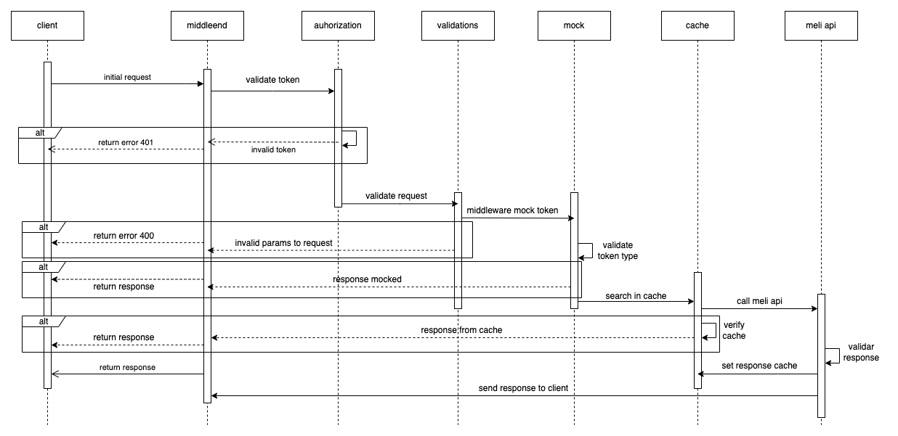

# Middleend Test API

_Instrucciones para ejecutar el api rest en local_

## Comenzando

_Estas instrucciones te permitirán ejecutar el api rest en tu maquina local._

### Requisitos 📋 

- Node >= 14
- Redis >= 6
- Git (deseado)

_Si tienes instalado git puedes clonar el repositorio a tu local con el siguiente comando:_

```
git clone https://github.com/poncho02/middleend-test.git
```

_En caso contrario descarga el zip y extraelo en tu maquina_

> (Redis):
> Para la instalación de redis-server en tu maquina local se recomienda seguir la documentación oficial.

```
https://redis.io/docs/getting-started/
```

Para la instalación de node en mac, debes tener instalado homebrew, paso siguiente ejecuta el comando:

```
brew install node
```

Confirma la versión de node con el siguiente comando:

```
node -v
```

Para la instalación de node en windows sigue la documentación oficial.

```
https://nodejs.org/es/download
```

Terminada las instalaciones y ubicandonos en el directorio del proyecto en la terminal, necesitamos instalar las dependencias necesarias.

```
npm install
```

En este punto el proyecto ya tiene lo necesario para ser levantado en tu maquina local, con los siguientes comandos podremos comenzar a usar el api rest.

En una ventana de la terminal ejecutamos lo siguiente para levantar el servidor de redis

```
redis-server
```

En otra ventana de la terminal ejecutamos lo siguiente para levantar el api

```
node app.js
```

Si tuvimos exito en la consola tendremos el siguiente mensaje:

```
⚡⚡ Server running on http://localhost:8080
```

> (.ENV):
> El api no necesita un archivo .env, pero si necesitas cambiar el puerto puedes crear un archivo .env en la raiz del proyecto y agregar la variable PORT=3000 o el puerto deseado y reiniciar el api rest.

#

### Swagger

Al levantar el api disponemos de una interfaz swagger para realizar pruebas de los endpoints disponibles.

```
http://localhost:8080/docs/api
```

Aquí disponemos de dos endpoints funcionales.

Obtener detalles de un item en especifico mediante ID de mercado libre

```
http://localhost:8080/v1/items/{id}
```

> id: `El parametro {id} debe ser un id valido del catalogo de mercado libre para los paises México, Brasil o Argentina.`.

Buscar un producto directamente en el catalogo de mercado libre

```
http://localhost:8080/v1/search/{site}/{query}
```

> site: `El parametro {site} es la nomenclatura de mercado libre correspondiente para los catalogos de México, Brasil o Argentina.`.
> query: `El parametro {query} es una palabra referente a la busqueda, entre mas exacta sea, los resultados serán mas precisos.`.

Ambos endpoints necesitan un header de autenticación, el api puede recibir dos tipos de token, un token valido que permite realizar la busqueda directamente en mercado libre y otro token de prueba que devuelve resultados mockeados.

El header debe llamarse "_x-auth-token_" y los valores posibles son los siguientes:

> token válido: `e962f81a-4d42-4eb3-86cd-a25e7237c8dc`
> token de prueba: `55a4639f-55e8-4e14-a6cc-b79977b20a4e`

Si deseas realizar las pruebas desde postman, en la siguiente ruta encontrarás la colección lista para ser importada.

```
https://github.com/poncho02/middleend-test/tree/master/documentation/postman
```

Diagrama de secuencia:



### Terminado
